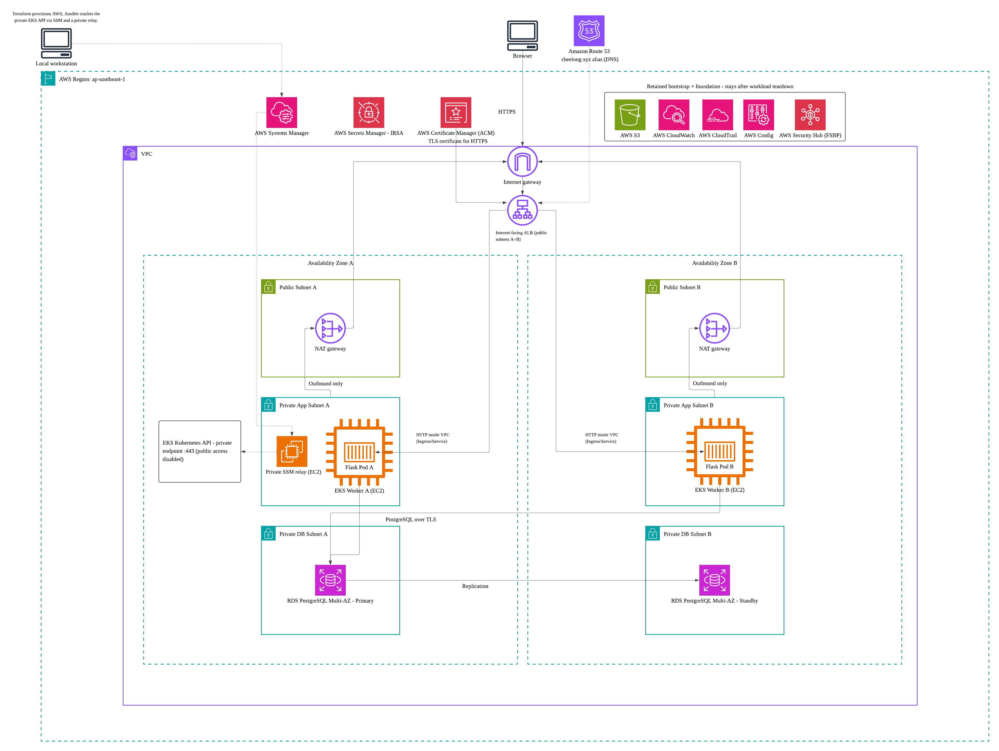

# AWS contact form on EKS

A Flask contact form for name, email, and message. PostgreSQL on Amazon RDS stores submissions; Amazon EKS runs the app. Terraform owns the AWS infrastructure, and Ansible owns the Kubernetes deployment.

**Status (26 September 2026):** The Flask form, PostgreSQL schema, local tests, and Docker image are verified; thirteen tests passed and a local browser submission reached PostgreSQL. The Terraform state bucket is provisioned and verified in AWS. Foundation and workload Terraform are drafted and locally validated but have not been applied. Ansible playbooks, Kubernetes manifests, and workstation helpers are drafted and pass local syntax checks, but have not been run against AWS. No EKS, RDS, or ALB resources have been deployed.

## Architecture



The environment is planned for `ap-southeast-1` across two Availability Zones (AZs):

- One internet-facing ALB uses the two public subnets. A NAT gateway in each public subnet provides outbound access for the worker in the same AZ.
- One EKS cluster has two managed node groups, each confined to one AZ with one EC2 worker. Two Flask replicas are spread across those workers.
- RDS PostgreSQL uses a Multi-AZ DB instance: one writer and one standby in separate private database subnets. The app connects to the writer endpoint, which can move after failover.
- The EKS Kubernetes API is private. Ansible runs on the local workstation and reaches it through an AWS Systems Manager (SSM) tunnel and a private EC2 relay. The relay has no public IP or inbound SSH rule.
- Terraform provisions the network, EKS, RDS, IAM, Secrets Manager, and supporting services. Ansible installs the AWS Load Balancer Controller and applies the Kubernetes Ingress. The controller creates **one** physical ALB; Terraform does not create a separate `aws_lb`.
- Route 53 and an ACM certificate are planned for the HTTPS hostname. Browser-to-ALB traffic uses HTTPS. ALB-to-pod traffic uses HTTP inside the VPC, restricted by security groups. Flask-to-RDS traffic must verify the RDS TLS certificate.

Secrets Manager holds two kinds of database credentials: the RDS-managed master secret and a separate, restricted application credential. The Flask pods read only the application secret using an IAM role for their Kubernetes service account (IRSA). The diagram leaves Secrets Manager unconnected to keep the traffic path readable; access is through the workers' same-AZ NAT gateways unless a VPC endpoint is added.

## Repository layout

Present now:

| Path | Purpose |
| --- | --- |
| `README.md` | Design, intended deployment sequence, and verification checklist |
| `ASSIGNMENT_PLAN.md` | Implementation decisions and task tracking |
| `docs/architecture.png` | High-level architecture diagram |
| `docs/security.md` | Planned controls, evidence commands, actual-findings register, and demo exceptions |
| `docs/cost.md` | Singapore cost estimate, approval gate, and post-destroy charges |
| `app/` | Flask form, SQL schema, Docker image, local Makefile, and integration tests; verified locally |
| `terraform/bootstrap/`, `terraform/foundation/`, `terraform/workload/` | Applied state-bucket bootstrap; foundation and workload are locally validated drafts; neither is applied |
| `ansible/` | Draft deploy/cleanup playbooks, manifests and runbook; locally syntax checked |
| `scripts/` | Draft tunnel, image publishing and ALB/DNS helpers |
| `.gitignore` | Excludes local secrets, state, plans, and generated files |

Foundation Terraform is locally validated but has not been applied; workload is a locally validated draft; Ansible is drafted but untested against EKS. Only the Terraform state bucket and its configuration have been created in AWS.

## Prerequisites and cost gate

Use a non-root AWS identity in account `203888389134` and Region `ap-southeast-1`. The workstation needs AWS CLI, Terraform, Ansible and required collections, kubectl, Helm, Python, Docker with WSL integration, PostgreSQL client tools, and the Session Manager plugin. Pin compatible tool and chart versions before the live rehearsal.

Run these **read-only checks** from the workstation:

```bash
aws sts get-caller-identity --profile contact-form-deployer
aws configure list --profile contact-form-deployer
aws --version
terraform version
ansible --version
kubectl version --client
helm version
docker version
session-manager-plugin --version
```

For a fresh Python environment, install the pinned workstation packages and Ansible collection:

    python3 -m venv /home/limch/.venvs/assignment
    source /home/limch/.venvs/assignment/bin/activate
    python -m pip install --no-cache-dir -r requirements-workstation.txt
    ansible-galaxy collection install -r ansible/requirements.yml

The Botocore CRT extra is required for this workstation's AWS login method. The repository contains no AWS access keys.

Check that the AWS identity is not root, the account ID is correct, Docker can reach its daemon, and the SSM plugin starts. `aws configure list` shows where credentials and the default Region come from; do not paste access keys into the repository.

**Do not apply foundation or workload Terraform until each tier's Singapore cost estimate and teardown plan have been reviewed and approved.** The state bucket was approved separately; with small state files and ordinary runs, its expected cost is well under US$1 for the assignment week, not a fixed fee or cap. Price the EKS cluster, two EC2 workers, two NAT gateways and data processing, the SSM relay, Multi-AZ RDS, ALB, Secrets Manager, ECR, Config/Security Hub, logs, DNS, public IPv4 addresses, and storage that remains after teardown. Check the account's credits, their expiry, and budget alerts. A US$10 monthly budget with a US$5 actual-cost email alert has been configured; it is not a hard spending cap. The current [Singapore planning estimate](docs/cost.md) is about US$5 in baseline charges for ten hours, with a US$10–20 allowance for variable charges before credits. It is neither a cap nor an AWS quote; regional rates, credit eligibility, and expiry still need verification. Domain registration is a separate cost.

Never commit AWS credentials, Terraform state or plan files, kubeconfig, private keys, database passwords, or real contact-form submissions.

## Verified Terraform state bootstrap

The non-root `contact-form-deployer` user in account `203888389134` created the state bucket `aws-contact-form-eks-tfstate-203888389134-ap-southeast-1` in Singapore. Terraform reported no drift after apply. Direct AWS checks returned versioning `Enabled`, all four public-access blocks `true`, default SSE-S3 encryption `AES256`, and `BucketOwnerEnforced` ownership. The bucket policy denies S3 requests when `aws:SecureTransport` is `false`. No foundation or workload state objects have been written yet.

For a fresh setup in this specific AWS account, attach the scoped `terraform/bootstrap/bucket-setup-policy.json` and `state-access-policy.json` as inline policies on an authorized non-root deployer before running:

```bash
cd /home/limch/projects/aws-contact-form-eks
umask 077
aws sts get-caller-identity --profile contact-form-deployer
terraform -chdir=terraform/bootstrap init
AWS_PROFILE=contact-form-deployer terraform -chdir=terraform/bootstrap plan -no-color
AWS_PROFILE=contact-form-deployer terraform -chdir=terraform/bootstrap apply -no-color
AWS_PROFILE=contact-form-deployer terraform -chdir=terraform/bootstrap plan -no-color
```

Confirm the account and review the plan and cost before typing `yes` at apply. The last plan should say `No changes`. The IAM policies are one-time account access setup performed in the IAM Console; the S3 resource itself was created by Terraform. The bucket-setup policy was removed after bootstrap verification on 26 September 2026; the ongoing state-access policy remains. Test backend access with that policy alone. Restore the setup policy temporarily for deliberate bootstrap maintenance. A full bucket teardown needs a separately reviewed deletion procedure after foundation and workload are gone.

Bootstrap state stays local at `terraform/bootstrap/terraform.tfstate` and is excluded from Git. The state and backup were restricted to owner-only mode `600`; use `umask 077` before future local Terraform runs. Preserve it securely: the S3 backend makes **foundation and workload state** shareable between workstations, not bootstrap's own local state. Do not run bootstrap apply from another checkout without first restoring this state or deliberately importing the bucket. AWS recommends waiting 15 minutes after first enabling S3 versioning before writing state objects to the bucket. [S3 versioning guidance](https://docs.aws.amazon.com/AmazonS3/latest/userguide/manage-versioning-examples.html).

## Deployment runbook

This is the target order for the local-workstation deployment. Bootstrap is applied and verified; foundation Terraform is a locally validated draft; workload is a locally validated draft and Ansible is drafted but not deployed. Complete and test each remaining stage before using its apply or deployment commands. Review the actual plan and cost before each apply.

1. **Build and test the app locally.** Start a local PostgreSQL instance, run the Flask tests, submit a test form, and query the saved row. Build the container and confirm it runs as a non-root user. Local development may use a separate local database credential; production credentials come from Secrets Manager.
2. **Bootstrap remote Terraform state (done for this account).** The encrypted, versioned S3 bucket is ready for foundation/workload state and S3 lockfiles. Preserve the local bootstrap state securely. Do not put secrets in Terraform inputs or outputs.
3. **Apply the persistent foundation.** Use `terraform/foundation/` for the state, DNS, retained logs/evidence, and other resources intended to survive a demo teardown. Inspect existing account-wide security services before trying to manage them.
4. **Apply the runtime infrastructure.** Use `terraform/workload/` for the VPC, two NAT gateways, private EKS cluster and worker groups, private relay, RDS Multi-AZ instance, application secret metadata, ECR, IAM roles, and security groups. Review the plan before applying it. Confirm Terraform outputs contain identifiers and endpoints, not secret values.
5. **Open the management tunnel.** Start an SSM port-forwarding session from the workstation through the private relay to the private EKS API. Use the tunnel-aware kubeconfig with TLS hostname verification intact. The drafted scripts/open_tunnel.py writes a TLS-verifying kubeconfig and forwards local port 8443. Verify `kubectl get nodes` before running Ansible.
6. **Run Ansible locally.** The drafted `ansible/deploy.yml` builds and pushes an immutable image to private ECR, installs the pinned AWS Load Balancer Controller, and applies the namespace, service accounts, RBAC, database setup Job, Deployment, ClusterIP Service, and HTTPS Ingress. The database Job creates the restricted app user and table on a fresh database; a rerun must reuse credentials and preserve rows. Ansible then waits for healthy ALB targets and creates the Route 53 alias.
7. **Verify the site and security controls.** Submit synthetic data through HTTPS, query its row from a controlled client inside the VPC, and record the evidence listed below. Run Ansible again and check that it makes no unwanted changes.

Bootstrap has been run and verified for this account. Check local and S3 state before live backend initialization, then apply the foundation in named stages. The three feature flags are required; each stage file supplies them together, and `-input=false` prevents an omitted file from becoming interactive prompts. The [Terraform runbook](terraform/README.md#backend-initialization) gives the state checks, stage choices, and ownership gates. These commands are for future use after cost approval and valid AWS login:

```bash
export AWS_PROFILE=contact-form-deployer
umask 077
terraform -chdir=terraform/foundation init
FOUNDATION_STAGE=stages/01-base.tfvars
terraform -chdir=terraform/foundation plan -input=false -var-file="$FOUNDATION_STAGE" -out=foundation.tfplan
terraform -chdir=terraform/foundation show -no-color foundation.tfplan
terraform -chdir=terraform/foundation apply foundation.tfplan
```

After inventory and ownership review, choose either `stages/02-security-existing-trail.tfvars` or `stages/02-security-project-trail.tfvars` and repeat the foundation plan/show/apply commands. Once registrar delegation is verified, use the matching `stages/03-ready-*.tfvars` file to request and validate the certificate. Keep the latest selected stage for later foundation plans. After stage 03 completes, complete the [read-only preflight](docs/preflight.md) to save `.local/verified-workload.tfvars.json`. After the workload state check is clear, initialize and plan the disposable root:

```bash
terraform -chdir=terraform/workload init
WORKLOAD_VARS="$PWD/.local/verified-workload.tfvars.json"
terraform -chdir=terraform/workload plan -input=false -var-file="$WORKLOAD_VARS" -out=workload.tfplan
terraform -chdir=terraform/workload show -no-color workload.tfplan
terraform -chdir=terraform/workload apply workload.tfplan
```

After the workload is applied and the tunnel works, the draft deployment command is:

```bash
ansible-playbook -i ansible/inventory.ini ansible/deploy.yml
```

The Ansible runbook gives the two-terminal tunnel/deploy sequence. These commands still require a live rehearsal and cost approval before use.

## Drafted workstation deployment

In terminal 1, activate the assignment virtualenv and open the SSM tunnel:

    cd /home/limch/projects/aws-contact-form-eks
    source /home/limch/.venvs/assignment/bin/activate
    export AWS_PROFILE=contact-form-deployer
    python3 scripts/open_tunnel.py

In terminal 2, use the generated kubeconfig and run Ansible:

    cd /home/limch/projects/aws-contact-form-eks
    source /home/limch/.venvs/assignment/bin/activate
    export AWS_PROFILE=contact-form-deployer
    export KUBECONFIG="$PWD/.local/kubeconfig"
    kubectl get nodes -L topology.kubernetes.io/zone
    ansible-playbook -i ansible/inventory.ini ansible/deploy.yml

The first command checks access to the private EKS API and worker placement. The playbook publishes or reuses an immutable image digest, installs the controller, initializes the restricted database user, applies the app and Ingress, creates the DNS alias and waits for HTTPS readiness. For cleanup, keep the tunnel open and run ansible-playbook -i ansible/inventory.ini ansible/teardown.yml before reviewing the Terraform destroy plan. See ansible/README.md for the exact sequence and safety checks. This sequence is drafted, not live-tested.

## IAM and database credentials

| Identity | Intended access |
| --- | --- |
| Local deployment identity | Non-root principal for Terraform, image publishing, EKS authentication, SSM session start, and Ansible operations. Scope it to this environment where AWS permits; record any broader provisioning permissions needed. |
| EKS worker role | Node registration, required ECR image pulls, and node functions. Do not give it the Flask database secret. |
| AWS Load Balancer Controller service account | Dedicated IAM role for ALB, target group, and related AWS changes. Scope resources to this cluster using supported tags and conditions. |
| Flask service account | IRSA role allowed to read only the application secret with `secretsmanager:GetSecretValue`; add `kms:Decrypt` only if its encryption key requires it. No RDS master-secret permission. |
| Database setup Job | Separate, short-lived access to the RDS-managed master secret and the application secret. It creates/reuses the restricted SQL user and schema without writing passwords to logs, Terraform state, or manifests. |
| Private SSM relay | Instance role needed for SSM management. No public IP, inbound SSH, or app database access. |
| Kubernetes deployer and app | RBAC grants only the operations each needs. The Flask service account does not need general Kubernetes API permissions. |

RDS generates and stores the master password in Secrets Manager. The app uses a different SQL user with only the database privileges it needs for submissions and health checks; schema changes belong to the setup Job. Terraform passes secret ARNs, not secret values. Ansible and Kubernetes manifests must not contain plaintext passwords.

## Planned security controls and evidence

These are **design targets, not claims of enabled controls**. Record actual values and dates after deployment.

| Area | Target and verification |
| --- | --- |
| Public access | Only the ALB accepts public inbound application traffic. EKS nodes, RDS, and the SSM relay have no public IP; the EKS Kubernetes API is private-only. Check subnet routes, public IPs, endpoint settings, and security groups. |
| Network rules | ALB accepts HTTPS (and HTTP only for redirect). App targets accept traffic from the ALB; RDS accepts PostgreSQL port 5432 only from the app or setup Job security group. Keep the relay's inbound management ports closed. |
| TLS | Route 53 hostname and ACM certificate at the ALB; HTTP from ALB to pods inside the VPC; verified RDS TLS from Flask. Test the public certificate and RDS certificate chain. |
| IAM and secrets | IRSA per workload, separate master/app secrets, no static AWS keys in pods, least-privilege SQL user. Inspect IAM policies and demonstrate that the app cannot read the master secret. |
| Kubernetes | Two replicas in different AZs; non-root process, no privilege escalation, dropped capabilities, health checks, resource requests/limits, and RBAC. Confirm with deployed pod specs and node AZ labels. |
| RDS and storage | Private, encrypted Multi-AZ RDS with backups during operation. Encrypt Terraform state and relevant logs; limit access to evidence and state buckets. |
| Logging | Enable selected EKS control-plane API, audit, authenticator, controller-manager, and scheduler logs; set retention and inspect CloudWatch log delivery. Review CloudTrail coverage without overwriting unrelated account configuration. |
| Security findings | Enable AWS Foundational Security Best Practices (FSBP) in Security Hub with the required AWS Config recording. Save dated findings, fixes, and remaining exceptions. A control still awaiting evaluation is not a pass. |

FSBP is the selected AWS foundational standard for this assignment. Do not claim CIS certification or that a control passed until it has been checked. Security Hub and Config may already be configured in the account; inspect them before Terraform takes ownership. Findings can take time to appear.

## End-to-end verification

Use non-secret Terraform outputs to supply `CLUSTER_NAME`, `DB_ID`, and `APP_SECRET_ARN`. These commands inspect metadata and settings; none retrieves a password.

```bash
aws eks describe-cluster --region ap-southeast-1 --name "$CLUSTER_NAME" --query 'cluster.{status:status,public:resourcesVpcConfig.endpointPublicAccess,private:resourcesVpcConfig.endpointPrivateAccess,logging:logging.clusterLogging}'
aws eks list-nodegroups --region ap-southeast-1 --cluster-name "$CLUSTER_NAME"
aws rds describe-db-instances --region ap-southeast-1 --db-instance-identifier "$DB_ID" --query 'DBInstances[0].{status:DBInstanceStatus,public:PubliclyAccessible,multiAZ:MultiAZ,encrypted:StorageEncrypted}'
aws secretsmanager describe-secret --region ap-southeast-1 --secret-id "$APP_SECRET_ARN" --query '{name:Name,arn:ARN,created:CreatedDate}'
kubectl get nodes -L topology.kubernetes.io/zone
kubectl -n contact-form get deployment,pods,service,ingress -o wide
aws securityhub get-enabled-standards --region ap-southeast-1
```

Also check the ALB target health, HTTPS form response, a submitted row through the short-lived readback Job inside the VPC, and survival of that row after replacing a Flask pod. After submitting a synthetic address such as `demo@example.com`, run `ansible-playbook -i ansible/inventory.ini ansible/verify.yml -e demo_email=demo@example.com` while the private API tunnel remains open. The Job uses the setup role and prints at most five matching rows; use synthetic data only. Re-run the Terraform plan and Ansible deployment to test repeatability. Capture FSBP findings with timestamps and distinguish newly pending checks from passes.

## Teardown and fresh rebuild

The runtime environment is disposable. **Destroying RDS deletes the contact-form submissions.** Use synthetic demo data only. RDS backups are enabled while it runs; the planned full demo teardown does not retain a final snapshot.

1. Stop submissions. Remove the Route 53 app alias and Kubernetes Ingress through the Ansible cleanup workflow.
2. Wait until the AWS Load Balancer Controller has deleted the ALB and target groups. Do not destroy EKS or the VPC first.
3. Remove the remaining Kubernetes resources, close the SSM tunnel, and destroy `terraform/workload/`. From the repository root, set `WORKLOAD_VARS="$PWD/.local/verified-workload.tfvars.json"`, then run `terraform -chdir=terraform/workload plan -destroy -input=false -var-file="$WORKLOAD_VARS" -out=workload-destroy.tfplan`. Review with `terraform -chdir=terraform/workload show -no-color workload-destroy.tfplan`; only then run `terraform -chdir=terraform/workload apply workload-destroy.tfplan`. The saved plan carries the verified version inputs.
4. Run `python3 scripts/check_residual.py --profile contact-form-deployer` after destroy. Exit 0 means no tagged runtime resources were found, 2 means resources remain, and 1 means an AWS read failed so cleanup is unproven. Inspect RDS, EKS, workers, ALB, NAT gateways, relay, Elastic IPs and retained foundation charges. Keep only the declared foundation: state, DNS/domain, and required security evidence.
5. Rebuild from Terraform, republish the image, and rerun Ansible. Use a fresh app secret name or another tested lifecycle strategy so Secrets Manager's deletion recovery window does not block recreation. Confirm the old demo row is absent and a new submission works.

Persistent foundation services can still cost money after runtime teardown. The residual-cost check is drafted but has not been run against AWS. It must be rehearsed before the demo. [Cost and teardown gate](docs/cost.md) and [security evidence](docs/security.md) cover remaining charges and findings.

## Reference documentation

- [AWS Load Balancer Controller and Ingress](https://docs.aws.amazon.com/eks/latest/userguide/aws-load-balancer-controller.html)
- [EKS service-account IAM roles](https://docs.aws.amazon.com/eks/latest/userguide/service-accounts.html)
- [RDS-managed master password](https://docs.aws.amazon.com/AmazonRDS/latest/UserGuide/rds-secrets-manager.html)
- [SSM Session Manager](https://docs.aws.amazon.com/systems-manager/latest/userguide/session-manager.html)
- [EKS control-plane logs](https://docs.aws.amazon.com/eks/latest/userguide/control-plane-logs.html)
- [Security Hub FSBP and Config](https://docs.aws.amazon.com/securityhub/latest/userguide/securityhub-setup-prereqs.html)
